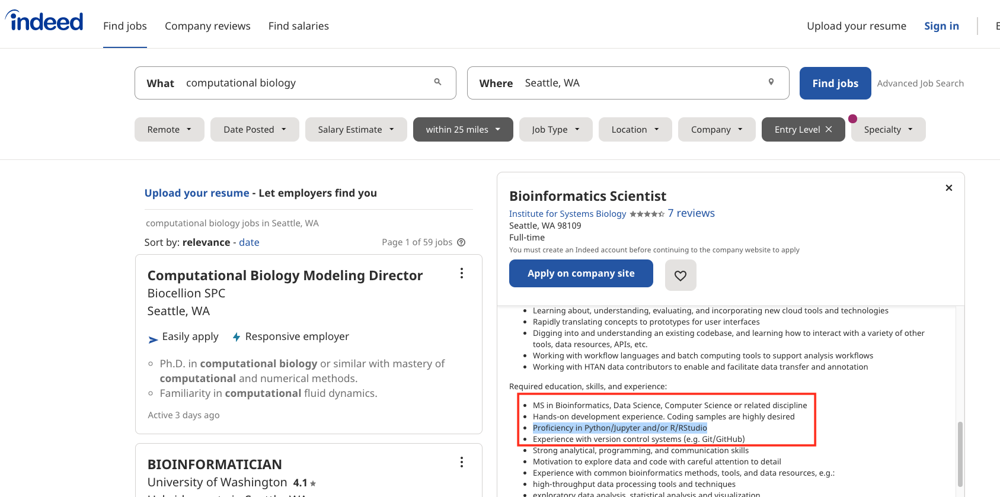
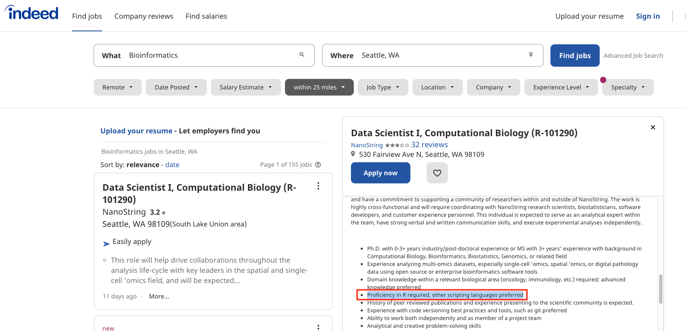
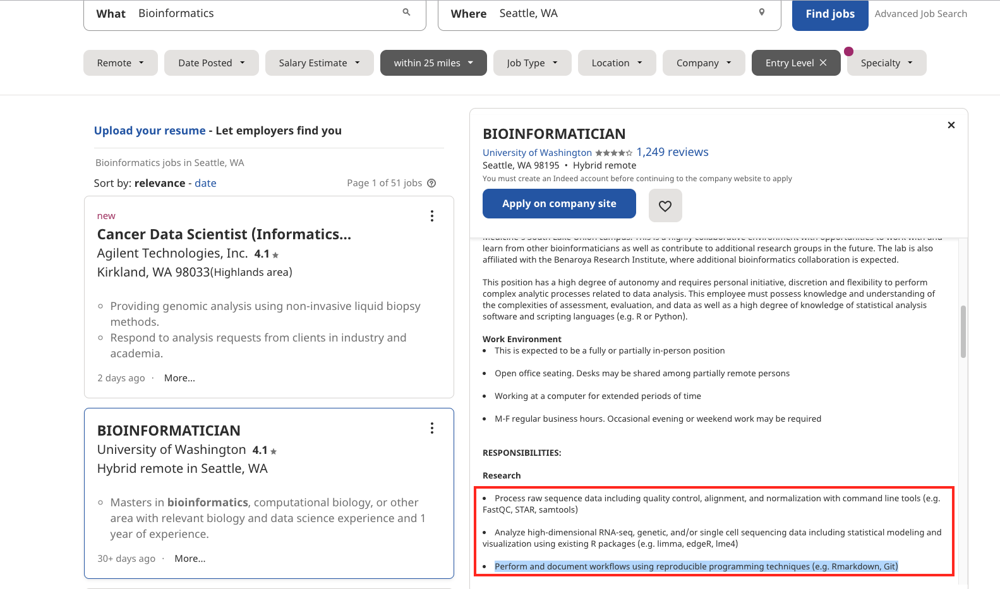
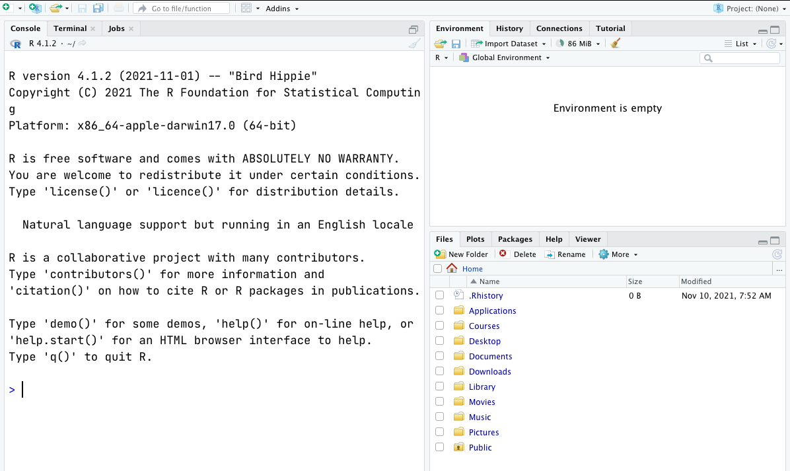
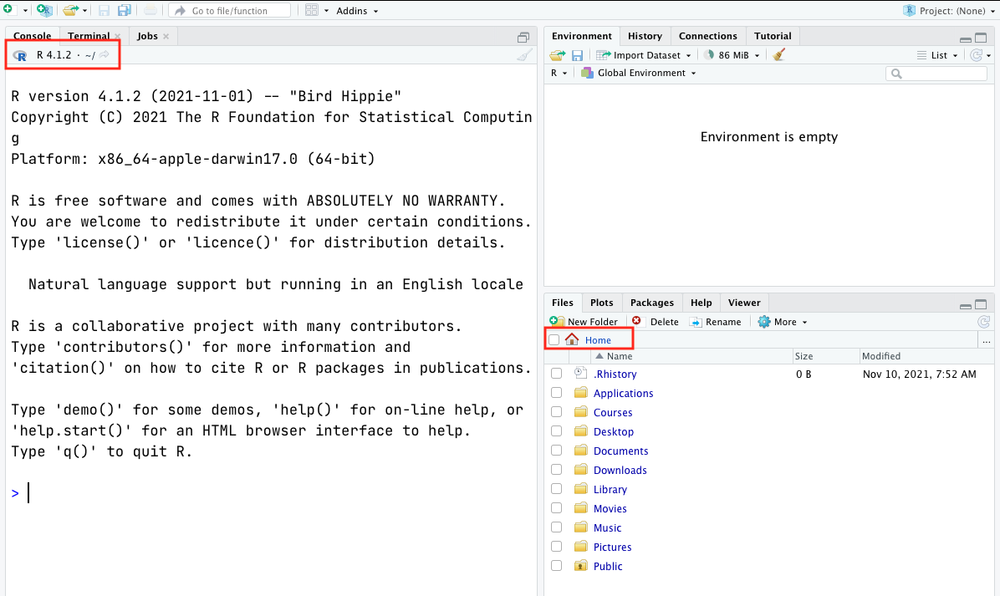

## Why R and Rstudio?

R is one of the [most widely-used and powerful programming languages](https://pypl.github.io/PYPL.html?country=US) in bioinformatics. R especially shines where a variety of statistical tools are required (e.g. RNA-Seq, population genomics, etc.) and in the generation of publication-quality graphs and figures. Rather than get into an R vs. Python debate (both are useful), keep in mind that many of the concepts you will learn apply to Python and other programming languages.

Further, there is a vibrant community out there that is collectively developing increasingly easy to use and powerful open source programming tools. The changing landscape of programming is making learning how to code easier than it ever has been. Incorporating programming into analysis workflows not only makes science more efficient, but also more computationally reproducible. In this course, we will use the programming language R, and the accompanying integrated development environment (IDE) RStudio. R is a great language to learn for data-oriented programming because it is widely adopted, user-friendly, and (most importantly) open source!

So what is the difference between R and RStudio? Here is an analogy to start us off. **If you were a chef, R is a knife**. You have food to prepare, and the knife is one of the tools that you’ll use to accomplish your task.

**And if R were a knife, RStudio is the kitchen**. RStudio provides a place to do your work! Other tools, communication, community, it makes your life as a chef easier. RStudio makes your life as a researcher easier by bringing together other tools you need to do your work efficiently - like a file browser, data viewer, help pages, terminal, community, support, the list goes on. So it’s not just the infrastructure (the user interface or IDE), although it is a great way to learn and interact with your variables, files, and interact directly with git. It’s also data science philosophy, R packages, community, and more. So although you can prepare food without a kitchen and we could learn R without RStudio, that’s not what we’re going to do. We are going to take advantage of the great RStudio support, and learn R and RStudio together.

Finally, we won’t lie; R is not the easiest-to-learn programming language ever created. So, don’t get discouraged! The truth is that even with the modest amount of R we will cover today, you can start using some sophisticated R software packages, and have a general sense of how to interpret an R script!

In this lesson will teach you how to start this process using R and RStudio. We will begin with raw data, perform exploratory analyses, and learn how to plot results graphically.

### Why is it popular/ widely-used?





## R at the console.

Launch R



Notice the default panes:

- Console (entire left)
- Environment/History (tabbed in upper right)
- Files/Plots/Packages/Help (tabbed in lower right)

Once you open files, such as R scripts, an editor panel will also open in the top left.




An important first question: **where are we?**

If you’ve just opened RStudio for the first time, you’ll be in your Home directory. This is noted by the `~/` at the top of the console. You can see too that the Files pane in the lower right shows what is in the Home directory where you are. You can navigate around within that Files pane and explore, but note that you won’t change where you are: even as you click through you’ll still be Home: `~/` .

## Workflow within RStudio
There are two main ways one can work within RStudio:  

 - Test and play within the interactive R console then copy code into a .R file to run later.  
	- This works well when doing small tests and initially starting off.  
	- It quickly becomes laborious.  
- Start writing in a .R file and use RStudio’s short cut keys for the Run command to push the current line, selected lines or modified lines to the interactive R console.  
	 - This is a great way to start; all your code is saved for later.  
	 - You will be able to run the file you create from within RStudio or using R’s source() function.  

## Intro to R

### Basics
The simplest thing you could do with R is to use it as a calculator. For example:

```r
1 + 100
```

When using R as a calculator, the order of operations is the same as you would have learned back in school.

From highest to lowest precedence:

- Parentheses: `(`, `)`
- Exponents: `^` or `**`
- Multiply: `*`
- Divide: `/`
- Add: `+`
- Subtract: `-`

```r
3 + 5 * (2 ^ 2) 
```
R has many built in mathematical functions. To call a function, we can type its name, followed by open and closing parentheses. Anything we type inside the parentheses is called the function’s arguments:

```r
# Natural Log of 1
log(1)
```

```r
# base-10 logarithm
log10(10) 
```

If trigonometry is your jam, then you could try this.

```r
sin(1)
```

We can also do comparisons in R. Here is the list of logical operators and expressions. 

`==` means is equal to
`!=` means ‘is not equal to’
`<` means is less than
`>` means is greater than
`<=` means is less than or equal to
`>=` means is greater than or equal to


```r
# Equality (note two equals signs, read as "is equal to")
1 == 1
```

```r
# Inequality (read as "is not equal to")
1 != 2
```

### Datatypes and Control Statements

Let's work in scripting mode from now on so that you will have the record of all commands we used in this lesson.

### Variables/objects

One of the main concepts of any programming language is a notion of a **variable**. Variables are created to store values for future use. 
To assign a value to a variable in R, use `<-` (Alt + dash) assignment operator:

```
### Variables

#variable `name` that stores value "Jane"
name <- "Jane"
print(name)

#variable `price` that stores value 3.99
price <- 3.99
print(price)

### working with environment
#remember what env does? it stores the objects you created. Let's see what the environment tab show us.
#How to see the list of variables on the screen?

#list all objects in your environment
ls()

#how to remove an object?
#rm(objectName)
rm(price)

#remove all objects, clear environment
rm(list=ls()) 

```


### Data types and Data structures


#### Smallest units in R: single-element data structures

Let's assign value of 45 to a variable `age`. We just created the smallest object in R:
```
age <- 45

#some useful functions to know more about the object 
length(age)
str(age)
```
Variables can hold values of various types. Most common data types:

* numeric(double+integer)
* character
* logical
* complex
* ...

To find out the data type of an object, use `typof()` function:

```
score<-79
typeof(score)
is.integer(score)
typeof(is.integer(score))
```

**A note on variable names:**
* NO SPACES in names
* DO NOT START with numbers
* Names should be MEANINGFUL - help yourself and others to understand your code! 


#### Data structures with multiple elements
We can combine single elements into collections of items.
Look at the gapminder dataset again. 
Our smallest unit can represent a single element in the dataset, like individual year, or individual country, 
but what would be the simplest object that you can make with multiple elements?

* **Vectors**: collection of elements of the same data type
	* how to create: use concatenate function, c()

```r
###let's make a vector
v<-c(1:3, 45)
v

#examine the object
   
length(v) # what does this do?

str(v)    # tells you the structure of the object - VERY USEFUL useful function

#view
head(v, n=2) or head(v, 2) #look at the first 2 elements

#what would `tail()` do?
tail(v, n=3)  #look at the last 3 elements

#manipulate
v <- c(v,56)  #add element to vector

#vectorizarion 
v1 <- 2*v   # multiply each vector element by 2
v1

# let's try to add vector, let's add v1 and v2, let's create v2
v2<-c(1:5)
v3 <- v1+v2
v3

#you can also create a character vector:
v4 <- c("Jane", "John", "Mary")
  
# change data type
v3 <- as.character(v3)  #also known as coersion
str(v3)
```

* **Matrices**: 2-dimensional vectors that contain elements of the same data type
	* how to create: use matrix() function

```r
m <- matrix(c(1:18), 3,6)
m
# try functions that we used for vectors - do they work on matrices?
# new to 2D structures
dim(m)  # tells you number of rows and columns in your matrix
```
* **Factors**: special vectors used to represent categorical data
	* to create: use factor()

```r
## let's look at our dataset gapminder.txt
##Let's say continent is a category with different levels (continent names)
#Let's create a factor continent with the names of the continent in our data
cont <- factor(c("asia","europe","america","africa", "oceania")) 
cont
str(cont)         # what are these numbers in the output?
typeof(cont)      # integer # factors are of integer data type! Levels are numbered in alphabetical order

```

* **Lists** : generic vectors - collection of elements with different data types
	* to create: use list() function

```r
l<-list("Afghanistan", 1952, 8769855)
print(l)
typeof(l)
str(l)
length(l)
```
**Challenge** 

```r
TASK: Try to create a list named 'myorder' that contains the 
following data structures as list elements:

-- Element 1 is a character vector of length 4 that 
lists the menu items you ordered from the restaurant: 
chicken, soup, salad, tea.

-- Element 2 is a factor that describes menu items
as "liquid" or "solid" categories.

-- Element 3 is a vector that records the cost of each menu item:
4.99, 2.99, 3.29, 1.89.

*Hint: Define your elements first, then create a list with them.
You will need c(), factor() and list() functions
```
**Challenge: Answer**

```r
menuItems<-c("chicken", "soup", "salad", "tea")
menuType<-factor(c("solid", "liquid", "solid", "liquid"))
menuCost<-c(4.99, 2.99, 3.29, 1.89)
myorder<-list(menuItems, menuType, menuCost)
```

Now apply the following functions to the list you created. Try to predict the output before you run the command.

- length(myorder)  
- str(myorder)  
- print(myorder)  

* **Data frames**
	* Could you make an informative guess about how this data structure can be represented in R?
	* Yes! It is a list of vectors of equal length, or a data frame.

Previously we used list() to combine our elements:

* `myorder<-list(menuItems, menuType, menuCost)`

Now let's combine with data.frame() function. How? Give it a different name, myorder_df.

```r
myorder_df<-data.frame(menuItems, menuType, menuCost)

#now view it!
myorder_df
#does it look like our gapminder data set?
#and check with str()
#anything different compared to str(myorder)
myorder
myorder_df
#output? What is happening with data types? 

str(myorder_df)
dim(myorder_df)
```

# if...else statements

Often when we're coding we want to control the flow of our actions. This can be done
by setting actions to occur only if a condition or a set of conditions are met.
Alternatively, we can also set an action to occur a particular number of times.

There are several ways you can control flow in R.
For conditional statements, the most commonly used approaches are the constructs:

```r
# if
if (condition is true) {
  perform action
}

# if ... else
if (condition is true) {
  perform action
} else {  # that is, if the condition is false,
  perform alternative action
}
```
Say, for example, that we want R to print a message if a variable `x` has a particular value:

```r
x <- 8

if (x >= 10) {
  print("x is greater than or equal to 10")
}

x
```

```r
8
```
The print statement does not appear in the console because x is not greater than 10. To print a different message for numbers less than 10, we can add an `else` statement.

```r
x <- 8

if (x >= 10) {
  print("x is greater than or equal to 10")
} else {
  print("x is less than 10")
}
```

You can also test multiple conditions by using `else if`.

```r
x <- 8

if (x >= 10) {
  print("x is greater than or equal to 10")
} else if (x > 5) {
  print("x is greater than 5, but less than 10")
} else {
  print("x is less than 5")
}
```

Important: when R evaluates the condition inside `if()` statements, it is looking for a logical element, i.e., `TRUE` or `FALSE`. This can cause some headaches for beginners. For example:

```r
x  <-  4 == 3
if (x) {
  "4 equals 3"
} else {
  "4 does not equal 3"
}
```

```r
[1] "4 does not equal 3"
```

As we can see, the not equal message was printed because the vector `x` is `FALSE`.

```r
x <- 4 == 3
x
```

```r
[1] FALSE
```

## Challenge 2
Use an `if()` statement to print a suitable message reporting whether there are any records from 2002 in the `gapminder` dataset. Now do the same for 2012.

*Hint: Use any() if you see an error*
**Solution**
```r
if(any(gapminder$year == 2002)){
   print("Record(s) for the year 2002 found.")
}
```

> Do you think we can apply `if` and `else` to our problem?

## Repeating operations

If you want to iterate over a set of values, when the order of iteration is important, and perform the same operation on each, a `for()` loop will do the job. We saw `for()` loops in the shell lessons earlier. This is the most flexible of looping operations, but therefore also the hardest to use correctly. Avoid using `for()` loops unless the order of iteration is important: i.e. the calculation at each iteration depends on the results of previous iterations.

The basic structure of a `for()` loop is:

```r
for(iterator in set of values){
  do a thing
}
```

```r
for(i in 1:10){
  print(i)
}
```

```r
[1] 1
[1] 2
[1] 3
[1] 4
[1] 5
[1] 6
[1] 7
[1] 8
[1] 9
[1] 10
```
The 1:10 bit creates a vector on the fly; you can iterate over any other vector as well.

For example, in our previous R lesson we had a `myorder_df`. We could iterate over each `menuItem` and display its cost.

```r
menuItems<-c("chicken", "soup", "salad", "tea")  
menuType<-factor(c("solid", "liquid", "solid", "liquid"))  
menuCost<-c(4.99, 2.99, 3.29, 1.89)  
myorder_df<-data.frame(menuItems, menuType, menuCost)

for (items in myorder_df$menuItems){
  myorder_df_subset <-  myorder_df[myorder_df$menuItems == items,]
  print(items)
  print(myorder_df_subset$menuCost)
}
```
> Now, you are equipped with all things necessary to solve our problem.

## Resources.

1. [R for Datascience](https://r4ds.had.co.nz/)
2. [Intro to R and Rstudio - Datacarpentry](https://datacarpentry.org/genomics-r-intro/)
3. [R for Reproducible Scientific Analysis](https://swcarpentry.github.io/r-novice-gapminder/)
4. [Introduction to Open Data Science](http://ohi-science.org/data-science-training/)
5. [Reproducible Research Techniques for Synthesis](https://learning.nceas.ucsb.edu/2019-11-RRCourse/index.html)
6. [Ten simple rules for biologists learning to program](https://doi.org/10.1371/journal.pcbi.1005871)
7. [Ten quick tips for delivering programming lessons](https://doi.org/10.1371/journal.pcbi.1007433)
8. [Much of this lesson was copied or adapted from Data Carpentry materials](https://swcarpentry.github.io/r-novice-gapminder/04-data-structures-part1/index.html)
9. [Control Statements](https://swcarpentry.github.io/r-novice-gapminder/07-control-flow/index.html)


