## Why do we need package managers such as  `conda`  ?

### Problem:  
The analysis of biological data is driven by the development of an extensive array of open-source software tools. Most of these tools carry out a single specialized step, which when chained together enables the creation of complex analysis workflows that process and analyze the increasing amount of biological data. However, with complex chains of steps, variability in operating systems and computational resources, and ambiguities with tool versioning and documentation, reproducibility of analysis workflows has become a key issue in computational biology. [1](https://www.nature.com/articles/s41592-021-01254-9)

### Solution:  
Workflow managers provide a framework for the creation, execution, and monitoring of pipelines. In recent years, a number of workflow managers have been specifically designed for biological data. [1](https://www.nature.com/articles/s41592-021-01254-9)

## Why  `conda`  specifically?  
Conda provides an isolated environment for pipeline execution in addition to efficiently installing pipeline dependencies. In particular, [Bioconda](https://bioconda.github.io/), a Conda channel specializing in bioinformatics, has contributed to the availability and ease of installation of bioinformatics tools. Bioconda provides over 8,000 maintained and curated Conda recipes for bioinformatics software. [1](https://www.nature.com/articles/s41592-021-01254-9)

## I have used  `pip`  before, can I simply use pip instead of  `conda`  ?

Yes but No. Pip is a package manager that is designed to install Python packages exclusively. In contrast, Conda is an open-source installer and package-management tool that can also handle both Python and non-Python library dependencies (like `ggplot` package for R program) 

Conda offers virtual environment capabilities and can run on multiple operating systems like Windows, Linux, and macOS. With Conda, you will be able to create, load, save, and switch between different environments. [2](https://linuxnetmag.com/miniconda-vs-anaconda/)

[Image Source](https://linuxnetmag.com/miniconda-vs-anaconda/)

## How to install  `conda`  ?  

For this course, we will install miniconda as it has a lighter footprint on storage.

### Step 1: Get the Miniconda3 Linux 64-bit link from conda website.

  - Let us navigate to the [conda website](https://docs.conda.io/en/latest/miniconda.html) and copy the link address for Miniconda3 Linux 64-bit under Linux platform (Right Click on the Miniconda3 Linux 64-bit).
  - Now execute the following command as shown in the image.  
  `wget https://repo.anaconda.com/miniconda/Miniconda3-latest-Linux-x86_64.sh`

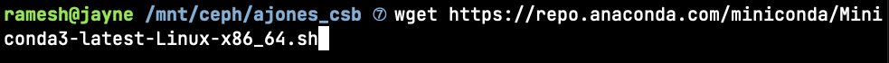

### Step 2: Since the downloaded file is a shell script, we need to add the executable permission to run the script.

  - Change the permission using the `chmod` command.  
  `chmod u+x Miniconda3-latest-Linux-x86_64.sh`

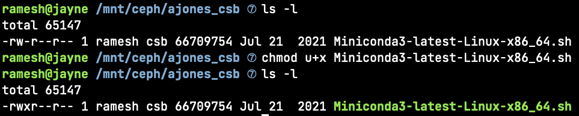

### Step 3: Let us run and initiliaze the conda environment as follows.

  - Run the script using the `bash` command.  
  `bash Miniconda3-latest-Linux-x86_64.sh` 

  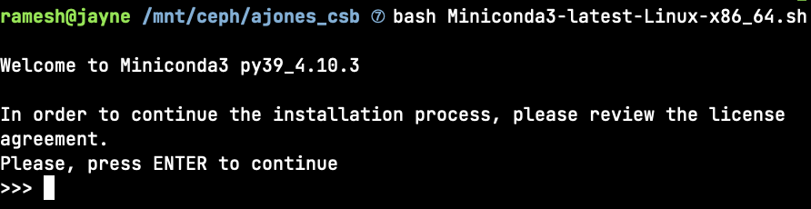

  - Agree to the terms and conditions of using miniconda.

  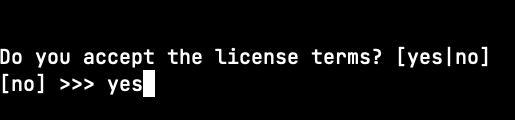

  - Make sure the path is your home directory,

  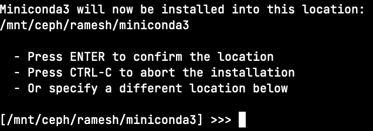

  - To initialize conda, type `yes`. Once the installation is complete, logout and log back it for changes to take effect. If you see `(base)` before username after you login, the conda installation and initialization was successful.

  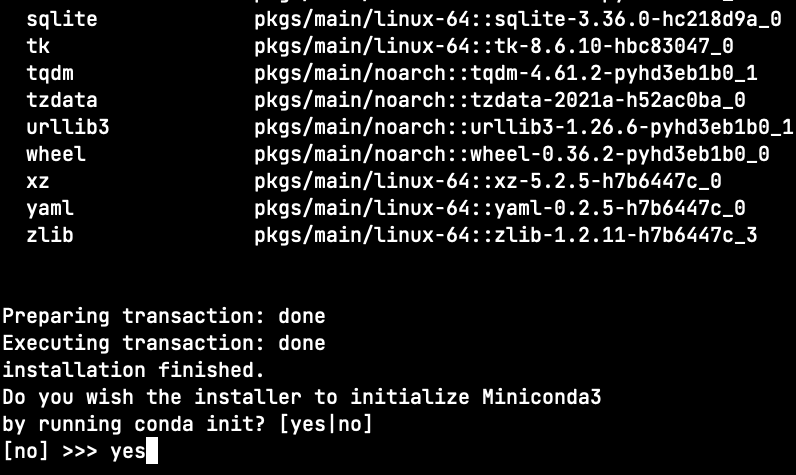  

  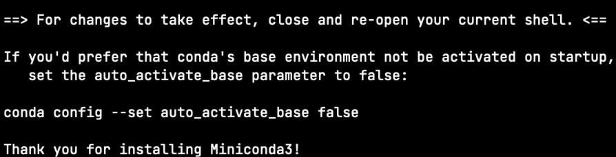  

  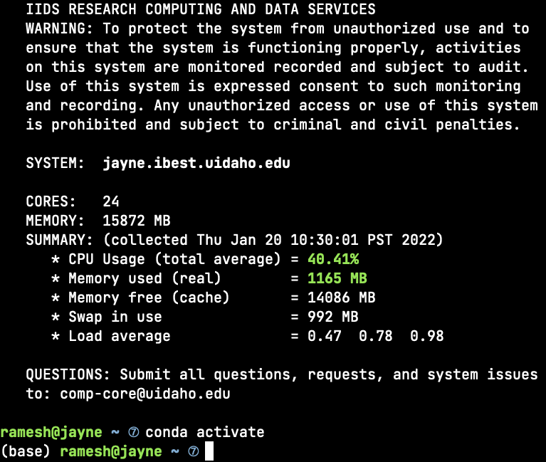  

## How to install  `Biopython`  ?

### Step 1:  
Simply try conda install biopython on your browser and most likely the first link should display the channel and command for the biopython package.

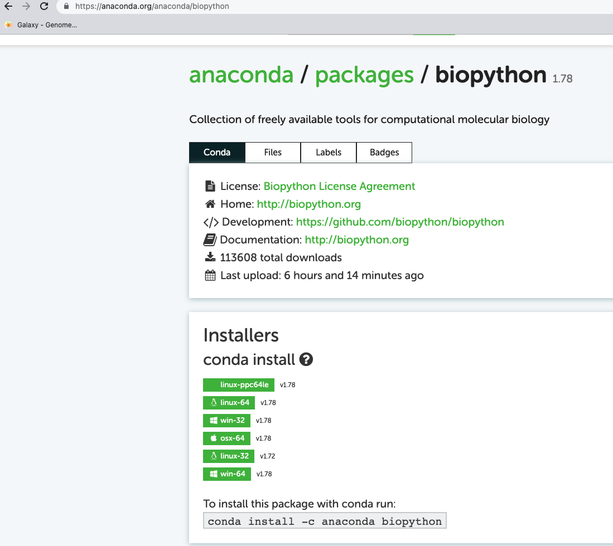

### Step 2:  
Try `conda install -c anaconda biopython`. Type `y` to proceed installation.

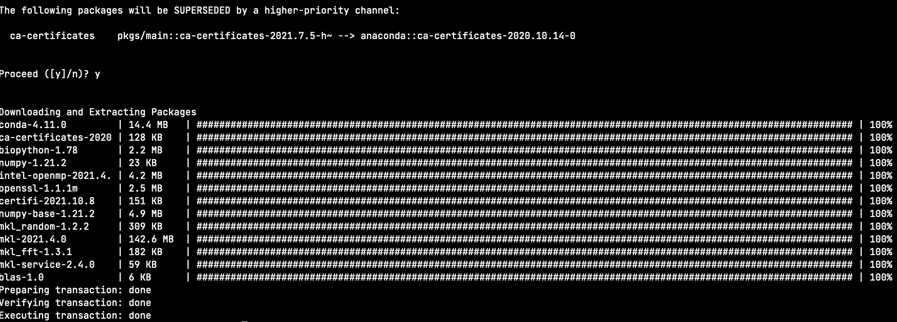

### Step 3:  
Let us verify the installation by using `python` command and by importing the biopython module using `import Bio`.

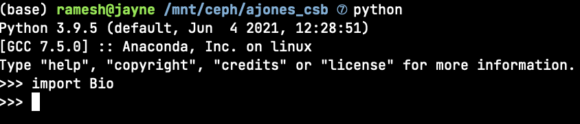

